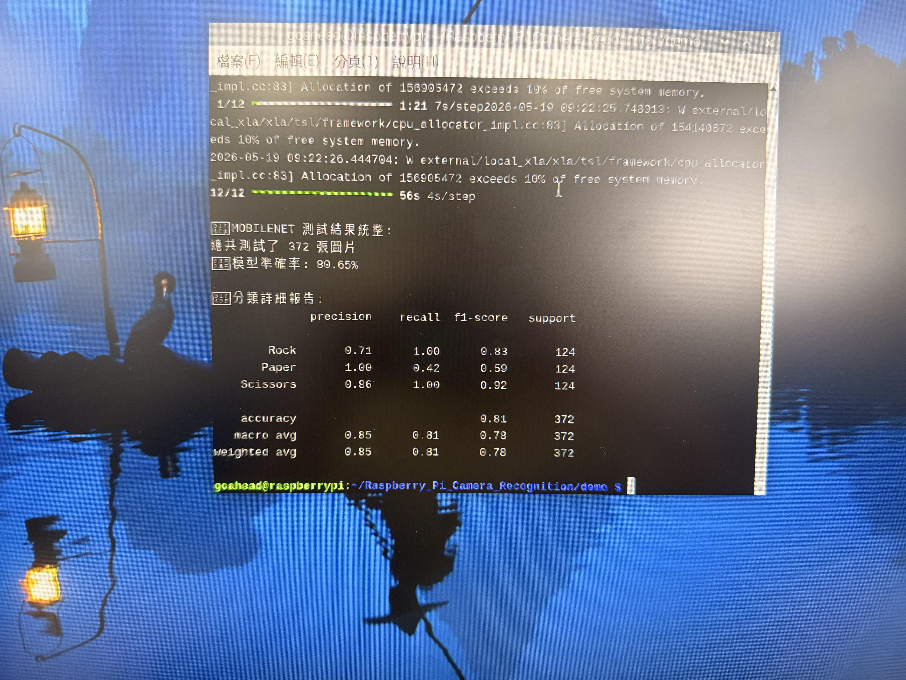
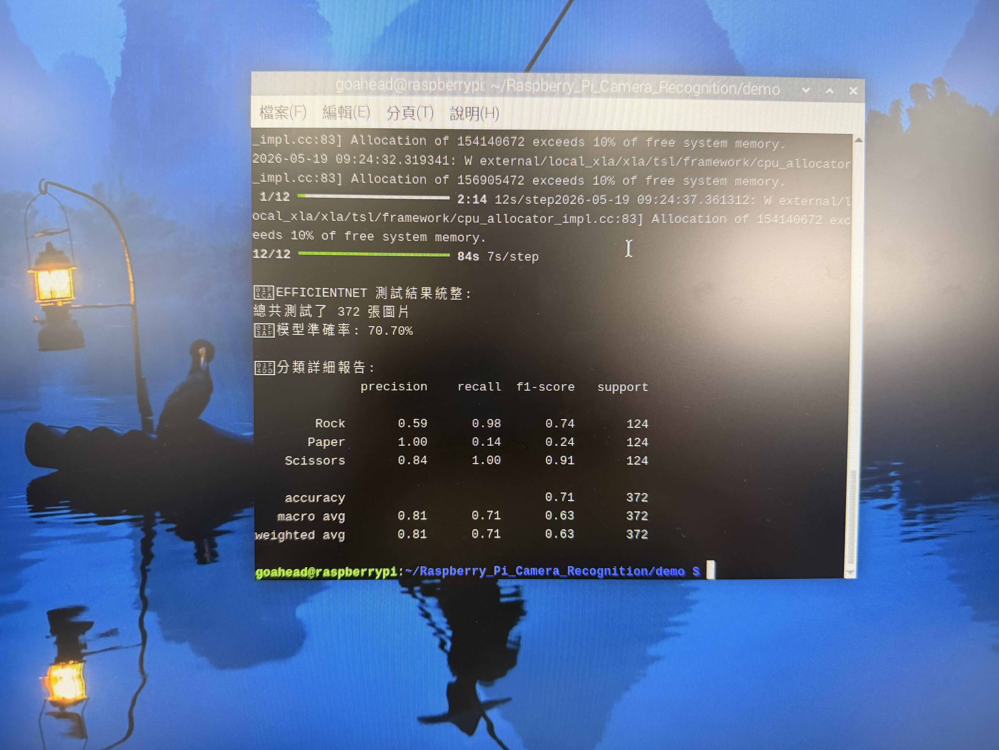

# Raspberry Pi Hand Gesture Recognition

此專案為在樹莓派上執行的手勢辨識 (剪刀、石頭、布) 實作，並包含了三種不同模型的訓練與測試程式。

## 目錄結構
- `dataset/`: 存放訓練 (train) 與測試 (test) 的影像資料集。
- `train/`: 包含訓練各種模型的程式碼與相依套件列表。
  - `train_svm.py`: 訓練 SVM 模型
  - `train_mobilenet.py`: 訓練 MobileNetV2 模型
  - `train_efficientnet.py`: 訓練 EfficientNetB0 模型
  - `requirements.txt`: 訓練環境的套件需求
- `demo/`: 存放訓練好的模型及實際應用於測試與相機即時辨識的程式。
  - `test.py`: 測試模型的準確率與分類報告
  - `pi_camera_recognition.py`: 樹莓派上使用的即時攝影機辨識程式
  - `carema.py`: 基本攝影機測試
  - `requirements.txt`: 執行測試與辨識環境的套件需求

## 模型訓練

若要重新訓練模型，請進入 `train` 目錄並執行對應的訓練程式：
```bash
cd train
pip install -r requirements.txt
# 訓練 SVM 模型
python train_svm.py
# 訓練 MobileNet 模型
python train_mobilenet.py
# 訓練 EfficientNet 模型
python train_efficientnet.py
```
訓練好的模型會自動儲存至 `demo/` 資料夾中。

## 模型測試 (test.py)

可以使用 `demo/test.py` 來測試已經訓練好的模型在 `dataset/test` 測試集上的表現。
這個程式會自動輸出模型的各項評估指標，包含 Accuracy, Precision, Recall, 與 F1-score：
```bash
cd demo
# 測試 SVM
python test.py --model svm

# 測試 MobileNet
python test.py --model mobilenet

# 測試 EfficientNet
python test.py --model efficientnet
```

**執行結果範例：**


## 基礎攝影機測試 (carema.py)

在進行手勢辨識前，如果你想要先確認樹莓派的鏡頭是否有接好、畫面是否能正常顯示，可以單純執行這個測試程式：
```bash
cd demo
python carema.py
```
執行後畫面會跳出攝影機的即時影像，按 `q` 鍵即可關閉。

## 樹莓派即時辨識

在樹莓派上啟動即時手勢辨識：
```bash
cd demo
pip install -r requirements.txt
```

執行即時辨識程式並指定使用的模型：
```bash
# 使用 SVM 辨識
python pi_camera_recognition.py --model svm
# 使用 MobileNet 辨識
python pi_camera_recognition.py --model mobilenet
# 使用 EfficientNet 辨識
python pi_camera_recognition.py --model efficientnet
```
執行後畫面中會出現一個綠色方框，請將手勢置於框內即可看到即時的辨識結果。按 `q` 鍵可離開程式。

**執行結果範例：**


---

## 樹梅派環境建立與刷機紀錄
1. 下載 [Raspberry Pi Imager](https://www.raspberrypi.com/software/)
2. 選擇 Raspberry Pi 4 64-bit 系統並寫入 SD 卡。
3. 設定 WiFi、Hostname、SSH 以及對應時區。
4. 將 SD 卡插入樹莓派後開機，並透過 SSH 連入安裝上述需求套件。

---

## 模型架構修改與比較 (期末報告 Part 3 要求)

本專案實作內容已涵蓋報告 Part 3 的相關要求：

### 1. 自行找兩個模型架構修改 (20%)
專案中除了基礎的 SVM 模型外，額外實作並引入了兩種不同的深度學習網路架構：
* **MobileNetV2** (`train_mobilenet.py`)
* **EfficientNetB0** (`train_efficientnet.py`)
> **評估指標呈現**：執行 `demo/test.py` 時，程式會自動計算並輸出這三個模型的完整指標，包含 **Accuracy (準確率)**、**Precision (精確率)**、**Recall (召回率)** 以及 **F1-score**。

### 2. 解釋更換模型原因及比較差異 (15%)
我們將原本的辨識方式擴展至 MobileNetV2 與 EfficientNetB0，原因與差異如下：

* **更換模型原因：**
  * 原先的基礎模型 (如 SVM) 通常需要依賴手動特徵提取或降維，面對背景複雜或光影變化較大的實際攝影機畫面時，辨識能力容易受限。
  * 為了提高在樹莓派上的實用性與魯棒性 (Robustness)，我們導入了能夠自動萃取深層特徵的卷積神經網路 (CNN)。
* **模型差異比較：**
  * **MobileNetV2**：主打輕量化與高速運算，使用了深度可分離卷積 (Depthwise Separable Convolution)。其最大優勢在於**參數量少、推論速度快**，非常適合算力受限的邊緣裝置（如樹莓派），能在確保基本準確率的情況下提供流暢的高 FPS 體驗。
  * **EfficientNetB0**：採用了複合縮放 (Compound Scaling) 技術，在深度、寬度及解析度間取得最佳平衡。相較於 MobileNetV2，它**保留了更多的特徵細節，準確率與各項指標表現通常更優秀**，但也相對需要稍微多一點的運算資源。
  * **總結**：如果在樹莓派上追求最即時的無延遲辨識，MobileNet 是首選；如果對手勢辨識的精準度有較高要求，則可以選擇切換為 EfficientNet 進行推論。

### 3. 模型結果展示
以下為新增模型的實際測試結果與指標（已從原始 HEIC 檔案轉換）：

**MobileNet 測試結果：**


**EfficientNet 測試結果：**

